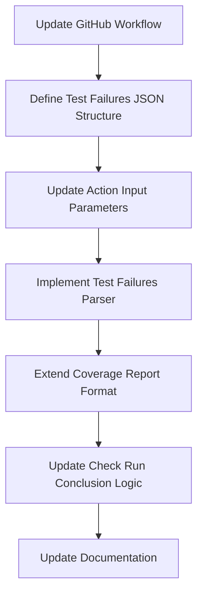

# Failed Test Reporting Extension Plan

## Overview

This document outlines the plan for extending the Vite PR Coverage Insight GitHub Action to:
1. Continue generating and posting the coverage report even when tests fail
2. Read a JSON file containing failed test information
3. Include a simplified list of failed tests in a collapsible section of the coverage report
4. Still exit with an error code to fail the pipeline

## Implementation Plan



### 1. Update GitHub Workflow

Modify the GitHub workflow to continue to the coverage reporting step even if tests fail by adding `continue-on-error: true` to the test steps:

```yaml
- name: Run coverage on PR
  run: yarn test:coverage
  continue-on-error: true
```

Also, add a step to generate the test failures JSON file during test execution. This could be done by modifying your test script or adding a post-test script that extracts failed test information.

### 2. Define Test Failures JSON Structure

Create a simplified structure for the test failures JSON file that only includes the filename and test names:

```json
{
  "numFailedTests": 3,
  "numTotalTests": 50,
  "failedTests": [
    {
      "testName": "should render component correctly",
      "filePath": "src/components/Button.test.js"
    },
    {
      "testName": "should handle click events",
      "filePath": "src/components/Input.test.js"
    }
  ]
}
```

### 3. Update Action Input Parameters

Modify the `action.yml` file to accept a new optional input parameter for the test failures file:

```yaml
inputs:
  github-token:
    required: true
    description: 'GitHub token for PR comment'
  base:
    required: true
    description: 'Path to base coverage-summary.json'
  head:
    required: true
    description: 'Path to PR coverage-summary.json'
  test-failures:
    required: false
    description: 'Path to test failures JSON file'
  use-check-run:
    required: false
    description: 'Whether to use GitHub Check Run API'
    default: 'false'
```

### 4. Implement Test Failures Parser

Create a new utility function to parse the test failures JSON file:

```typescript
// src/utils/parseTestFailures.ts
export type TestFailure = {
  testName: string;
  filePath: string;
};

export type TestFailuresResult = {
  numFailedTests: number;
  numTotalTests: number;
  failedTests: TestFailure[];
};

export function parseTestFailures(filePath: string): TestFailuresResult | null {
  try {
    const fileContent = fs.readFileSync(filePath, 'utf-8');
    return JSON.parse(fileContent) as TestFailuresResult;
  } catch (error) {
    console.warn(`Warning: Could not parse test failures file: ${error}`);
    return null;
  }
}
```

### 5. Extend Coverage Report Format

Update the `formatCoverageMarkdown.ts` file to include a simplified failed test information in a collapsible section:

```typescript
export function formatCoverageMarkdown(
  rows: {
    metric: string;
    base: number;
    pr: number;
    delta: number;
    symbol: string;
  }[],
  fileCoverage: FileCoverageResult,
  testFailures?: TestFailuresResult | null,
  prInfo?: {
    owner: string;
    repo: string;
    prNumber: number;
  }
) {
  // Existing code for formatting coverage report...
  
  // Add test failures section if available
  let testFailuresSection = '';
  if (testFailures && testFailures.numFailedTests > 0) {
    testFailuresSection = `\n\n---\n\n<details><summary>❌ Failed Tests (${testFailures.numFailedTests}/${testFailures.numTotalTests})</summary>\n\n`;
    
    // Group failures by file
    const failuresByFile: Record<string, string[]> = {};
    testFailures.failedTests.forEach(failure => {
      if (!failuresByFile[failure.filePath]) {
        failuresByFile[failure.filePath] = [];
      }
      failuresByFile[failure.filePath].push(failure.testName);
    });
    
    // Format each file's failures
    Object.entries(failuresByFile).forEach(([filePath, testNames]) => {
      const fileName = filePath.split('/').pop() || filePath;
      testFailuresSection += `\n### 📄 ${fileName}\n\n`;
      
      testNames.forEach(testName => {
        testFailuresSection += `- ${testName}\n`;
      });
      
      testFailuresSection += '\n';
    });
    
    testFailuresSection += '</details>\n\n---';
  }
  
  return `${mainTable}${fileDetailsSection}${testFailuresSection}`;
}
```

### 6. Update Check Run Conclusion Logic

Modify the `postCoverageCheckRun.ts` file to consider test failures when determining the conclusion:

```typescript
export async function postCoverageReport({
  token,
  owner,
  repo,
  prNumber,
  markdown,
  testFailures,
  useCheckRun = false
}: {
  token: string;
  owner: string;
  repo: string;
  prNumber: number;
  markdown: string;
  testFailures?: TestFailuresResult | null;
  useCheckRun?: boolean;
}): Promise<void> {
  // Existing code...
  
  // Optionally post as a check run
  if (useCheckRun) {
    // Determine conclusion based on coverage and test failures
    let conclusion: "success" | "failure" | "neutral" = "success";
    
    // If coverage decreased, set to neutral
    if (markdown.includes("⬇️")) {
      conclusion = "neutral";
    }
    
    // If tests failed, set to failure
    if (testFailures && testFailures.numFailedTests > 0) {
      conclusion = "failure";
    }
    
    await postCoverageCheckRun({
      token,
      title: "Coverage Report",
      summary: markdown,
      conclusion,
    });
  }
}
```

### 7. Update Main Function

Update the main function in `index.ts` to handle the new test failures parameter and still exit with an error code:

```typescript
async function run() {
  try {
    const githubToken = getInput("github-token", { required: true });
    const basePath = getInput("base", { required: true });
    const headPath = getInput("head", { required: true });
    const testFailuresPath = getInput("test-failures");
    const useCheckRun = getInput("use-check-run") === "true";

    // Read coverage data from files
    const baseJson = fs.readFileSync(path.resolve(basePath), "utf-8");
    const headJson = fs.readFileSync(path.resolve(headPath), "utf-8");

    const base: CoverageSummary = JSON.parse(baseJson);
    const pr: CoverageSummary = JSON.parse(headJson);

    // Parse test failures if provided
    let testFailures: TestFailuresResult | null = null;
    if (testFailuresPath) {
      testFailures = parseTestFailures(path.resolve(testFailuresPath));
    }

    // Get PR information
    const { owner, repo } = context.repo;
    const prNumber = context.payload.pull_request?.number;

    if (!prNumber) throw new Error("Pull request number not found");

    // Generate the markdown report with PR information and test failures
    const markdown = generateCoverageReport(base, pr, testFailures, { owner, repo, prNumber });

    // Post the report to the PR
    await postCoverageReport({
      token: githubToken,
      owner,
      repo,
      prNumber,
      markdown,
      testFailures,
      useCheckRun
    });
    
    console.log("✅ Coverage report successfully posted to PR");
    
    // Exit with error code if tests failed
    if (testFailures && testFailures.numFailedTests > 0) {
      console.error(`❌ ${testFailures.numFailedTests} tests failed`);
      process.exit(1); // Fail the pipeline
    }
  } catch (error) {
    console.error("❌ Error generating coverage comment:", error);
    process.exit(1);
  }
}
```

### 8. Update Documentation

Update the README.md file to document the new feature and how to use it:

```markdown
## Failed Test Reporting

This action now supports reporting failed tests alongside coverage information. To use this feature:

1. Configure your test runner to output failed test information to a JSON file
2. Add the `test-failures` input parameter to the action configuration

The action will:
- Generate and post the coverage report even when tests fail
- Include a list of failed tests in the report
- Still exit with an error code to fail the pipeline

Example workflow:

```yaml
- name: Run tests with coverage
  run: yarn test:coverage
  continue-on-error: true

- name: Run vite-pr-coverage-insight action
  uses: subhashmahimaluri/vite-pr-coverage-insight@v1.3.0
  with:
    github-token: ${{ secrets.GITHUB_TOKEN }}
    base: base-coverage/coverage-summary.json
    head: pr-coverage/coverage-summary.json
    test-failures: test-failures.json
```

## Implementation Timeline

1. **Phase 1: Core Implementation**
   - Update action.yml with new input parameter
   - Create test failures parser utility
   - Update main function to handle test failures

2. **Phase 2: Report Enhancement**
   - Extend markdown formatter to include test failures section
   - Update check run conclusion logic

3. **Phase 3: Documentation & Testing**
   - Update README with usage instructions
   - Create example test failures JSON for testing
   - Test the implementation with various scenarios