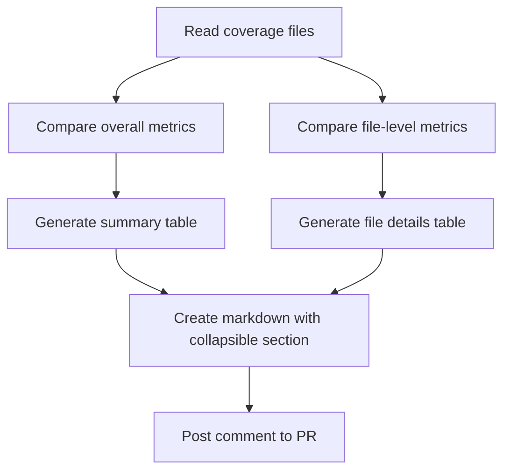

# Toggle Feature Implementation Plan

## Current Understanding

The project is a GitHub Action that:
1. Reads coverage data from base and PR branches in Istanbul format
2. Compares overall coverage metrics (statements, branches, functions, lines)
3. Generates a markdown report and posts it as a PR comment

Currently, the tool only shows overall coverage metrics but doesn't display file-level details. The goal is to add a toggle feature that shows file-level coverage changes using HTML details/summary tags for collapsible content.

## Implementation Plan

Here's the proposed plan for adding the toggle feature:



### 1. Update CoverageSummary Type

First, we need to update the `CoverageSummary` type to include file-level coverage data:

```typescript
export type CoverageSummary = {
  total: {
    lines: { pct: number };
    statements: { pct: number };
    functions: { pct: number };
    branches: { pct: number };
  };
  [key: string]: {
    lines: { pct: number };
    statements: { pct: number };
    functions: { pct: number };
    branches: { pct: number };
  };
};
```

### 2. Create File-Level Comparison Function

Add a new function to compare file-level coverage between base and PR:

```typescript
export function compareFileCoverage(base: CoverageSummary, pr: CoverageSummary) {
  const metrics = ['statements', 'branches', 'functions', 'lines'] as const;
  const fileChanges: {
    file: string;
    metrics: {
      metric: string;
      base: number;
      pr: number;
      delta: number;
      symbol: string;
    }[];
  }[] = [];

  // Get all unique file paths from both base and PR
  const allFiles = new Set<string>();
  Object.keys(base).forEach(key => {
    if (key !== 'total') allFiles.add(key);
  });
  Object.keys(pr).forEach(key => {
    if (key !== 'total') allFiles.add(key);
  });

  // Compare each file's coverage
  allFiles.forEach(file => {
    const fileMetrics = metrics.map(metric => {
      const basePct = base[file]?.[metric]?.pct ?? 0;
      const prPct = pr[file]?.[metric]?.pct ?? 0;
      const delta = parseFloat((prPct - basePct).toFixed(2));

      return {
        metric,
        base: basePct,
        pr: prPct,
        delta,
        symbol: delta > 0 ? '⬆️' : delta < 0 ? '⬇️' : '➖',
      };
    });

    // Only include files with changes
    if (fileMetrics.some(m => m.delta !== 0)) {
      fileChanges.push({
        file,
        metrics: fileMetrics,
      });
    }
  });

  return fileChanges;
}
```

### 3. Update the Main Function

Modify the main function to call the new file comparison function:

```typescript
async function run() {
  try {
    // ... existing code ...

    const base: CoverageSummary = JSON.parse(baseJson);
    const pr: CoverageSummary = JSON.parse(headJson);

    const rows = compareCoverage(base, pr);
    const fileChanges = compareFileCoverage(base, pr);
    const markdown = formatCoverageMarkdown(rows, fileChanges);

    // ... existing code ...
  } catch (error) {
    console.error("❌ Error generating coverage comment:", error);
  }
}
```

### 4. Update the Markdown Formatter

Enhance the `formatCoverageMarkdown` function to include the collapsible file details section:

```typescript
export function formatCoverageMarkdown(
  rows: {
    metric: string;
    base: number;
    pr: number;
    delta: number;
    symbol: string;
  }[],
  fileChanges: {
    file: string;
    metrics: {
      metric: string;
      base: number;
      pr: number;
      delta: number;
      symbol: string;
    }[];
  }[]
) {
  // Format the summary table (existing code)
  const header = `### 📊 Vite Coverage Report\n\n| Metric     | Base     | PR       | ∆        |\n|------------|----------|----------|----------|`;
  
  const lines = rows.map(
    ({ metric, base, pr, delta, symbol }) =>
      `| ${metric} | ${base.toFixed(2)}% | ${pr.toFixed(2)}% | ${delta >= 0 ? '+' : ''}${delta.toFixed(2)}% ${symbol} |`
  );

  // Format the file details section (new code)
  let fileDetailsSection = '';
  
  if (fileChanges.length > 0) {
    fileDetailsSection = '\n\n<details>\n<summary>📁 Show file-level coverage changes</summary>\n\n';
    
    // Group files by whether they improved or worsened
    const improved = fileChanges.filter(f => f.metrics.some(m => m.delta > 0));
    const worsened = fileChanges.filter(f => f.metrics.some(m => m.delta < 0));
    
    if (improved.length > 0) {
      fileDetailsSection += '#### ✅ Improved Coverage\n\n';
      improved.forEach(file => {
        fileDetailsSection += `**${file.file}**\n\n`;
        fileDetailsSection += '| Metric | Base | PR | ∆ |\n|--------|------|----|----|';
        file.metrics.forEach(({ metric, base, pr, delta, symbol }) => {
          fileDetailsSection += `\n| ${metric} | ${base.toFixed(2)}% | ${pr.toFixed(2)}% | ${delta >= 0 ? '+' : ''}${delta.toFixed(2)}% ${symbol} |`;
        });
        fileDetailsSection += '\n\n';
      });
    }
    
    if (worsened.length > 0) {
      fileDetailsSection += '#### ⚠️ Decreased Coverage\n\n';
      worsened.forEach(file => {
        fileDetailsSection += `**${file.file}**\n\n`;
        fileDetailsSection += '| Metric | Base | PR | ∆ |\n|--------|------|----|----|';
        file.metrics.forEach(({ metric, base, pr, delta, symbol }) => {
          fileDetailsSection += `\n| ${metric} | ${base.toFixed(2)}% | ${pr.toFixed(2)}% | ${delta >= 0 ? '+' : ''}${delta.toFixed(2)}% ${symbol} |`;
        });
        fileDetailsSection += '\n\n';
      });
    }
    
    fileDetailsSection += '</details>';
  }

  return [header, ...lines].join('\n') + fileDetailsSection;
}
```

## Implementation Details

1. **Type Updates**:
   - Extend the `CoverageSummary` type to include file-level data
   - Create a new type for file-level coverage changes

2. **File Comparison Logic**:
   - Create a new function `compareFileCoverage` that identifies files with coverage changes
   - Filter to only include files with actual changes in coverage metrics

3. **Markdown Formatting**:
   - Use HTML `<details>` and `<summary>` tags for the collapsible section
   - Group files by improved vs. decreased coverage for better readability
   - Format each file's metrics in a table similar to the summary table

4. **UI Considerations**:
   - The toggle will appear as "📁 Show file-level coverage changes" at the bottom of the main table
   - When expanded, it will show tables for each file with coverage changes
   - Files will be grouped into "Improved Coverage" and "Decreased Coverage" sections

## Benefits

1. **Focused Information**: Only shows files with actual coverage changes
2. **Clean UI**: Keeps the main view simple with the option to see details
3. **Actionable Insights**: Clearly identifies which files improved or worsened
4. **GitHub Compatible**: Uses native HTML tags that work in GitHub markdown